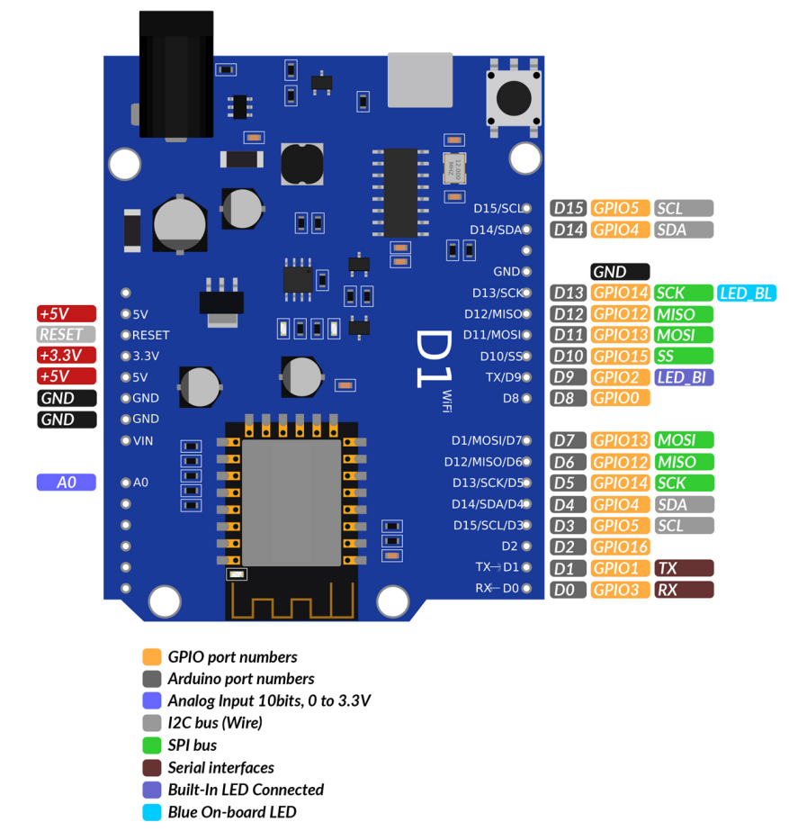

# The Ultimate IoT workshop

## Table of contents

- [00 Before we start](lessons/00/00.md)
- [01 Our first code](lessons/01/01.md)
- [02 Using the serial monitor](lessons/02/02.md)
- [03 Connecting a display](lessons/03/03.md)
- [04 Connecting a temperature sensor](lessons/04/04.md)
- [05 Connecting an RTC module](lessons/05/05.md)
- [06 Connecting to a wifi network](lessons/06/06.md)
- [07 Final program](lessons/07/07.md)

## Ports and connections of the D1 module

