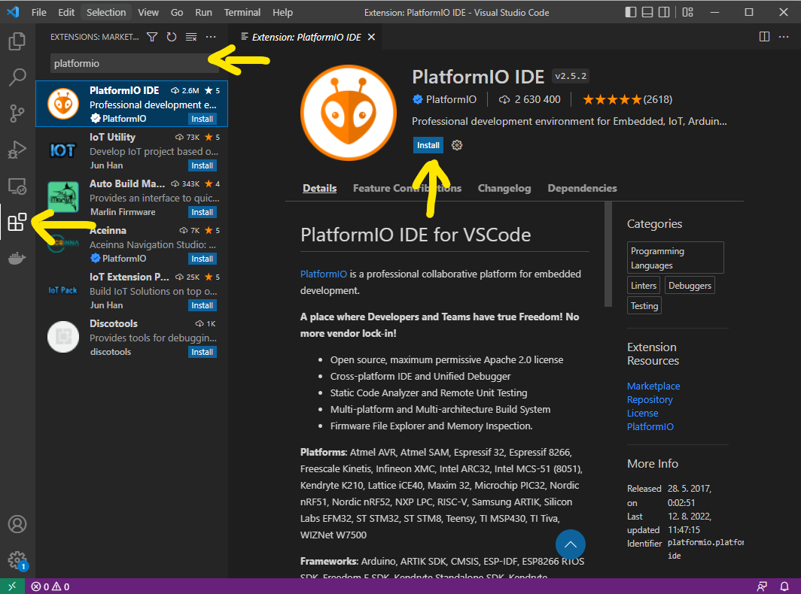

# 00 Before we start

## 1. Install VS Code

- you can download VS Code from here https://code.visualstudio.com/download

## 2. Install USB driver for the development board

- download and install this driver (it's no malware I promise :)  
  - [Windows](/software/win/usb_driver.zip)
  - [Mac](/software/mac/usb_driver_MAC.ZIP)  

## 3. Installing Platformio IDE
- open `Visual Studio Code`  
- click `Extensions` in the left bar
- search for `Platformio`
- click `Install`

