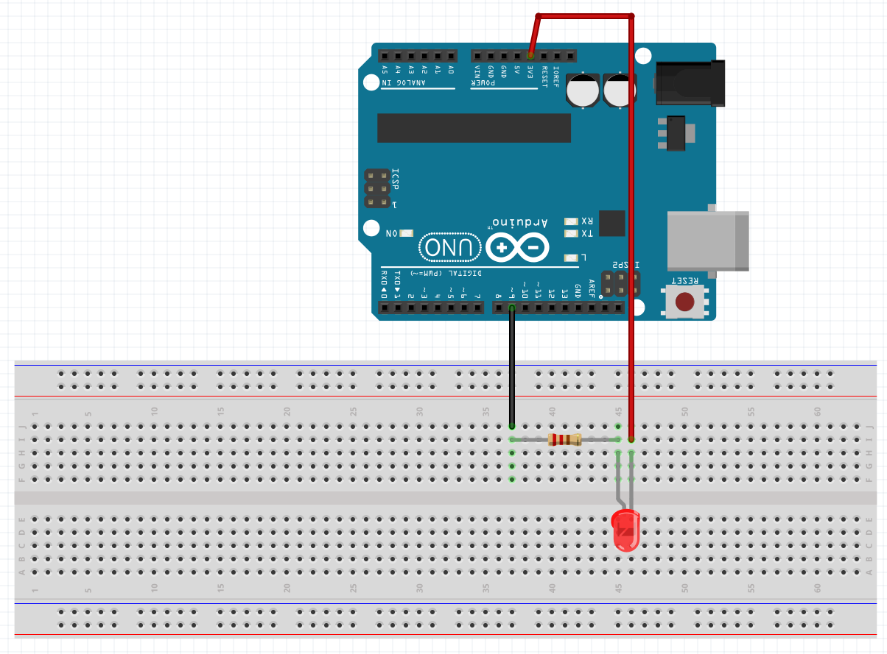

# 01 Our first code

<br>
This is a simple program that will make an LED blink 

```C
#include <Arduino.h>

void setup() {
    pinMode(LED_BUILTIN, OUTPUT);
}

void loop() {
    digitalWrite(LED_BUILTIN, LOW);
    delay(1000);

    digitalWrite(LED_BUILTIN, HIGH);
    delay(1000);
 }
```
<br><br><br>
#### Connect an extra LED using this scheme
<br><br>

