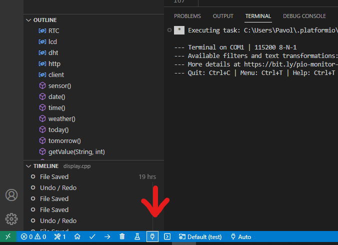

# 02 Using the serial monitor

<br>
To use the serial monitor we need to add this command to our `setup()` function:
<br/><br/>

```C
Serial.begin(115200);
```
<br><br>
Next we need to add the serial monitor to our program by writing these commands.
<br><br>
```C
Serial.print("Hello, world!");

Serial.println("Hello, world!");
```
<br><br>

#### You can find the serial monitor in VS Code here:
<br>


