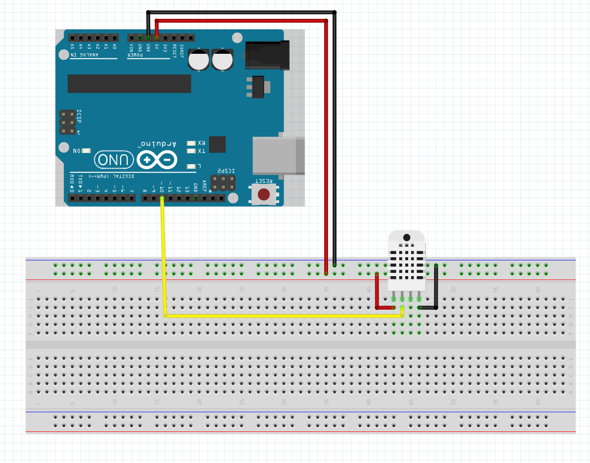

# 04 Zapojenie modulu na meranie teploty

```C
String sensor() {
    float h = dht.readHumidity();
    float t = dht.readTemperature();
    String result;

    while(isnan(h)) {
        h = dht.readHumidity();
        delay(100);
    }

    while(isnan(t)) {
        t = dht.readTemperature();
        delay(100);
    }

    result = String(t, 0) + "'C / ";
    result += String(h, 0) + "%";

    Serial.println(result);
    return result;
}
```
<br>
<br>


