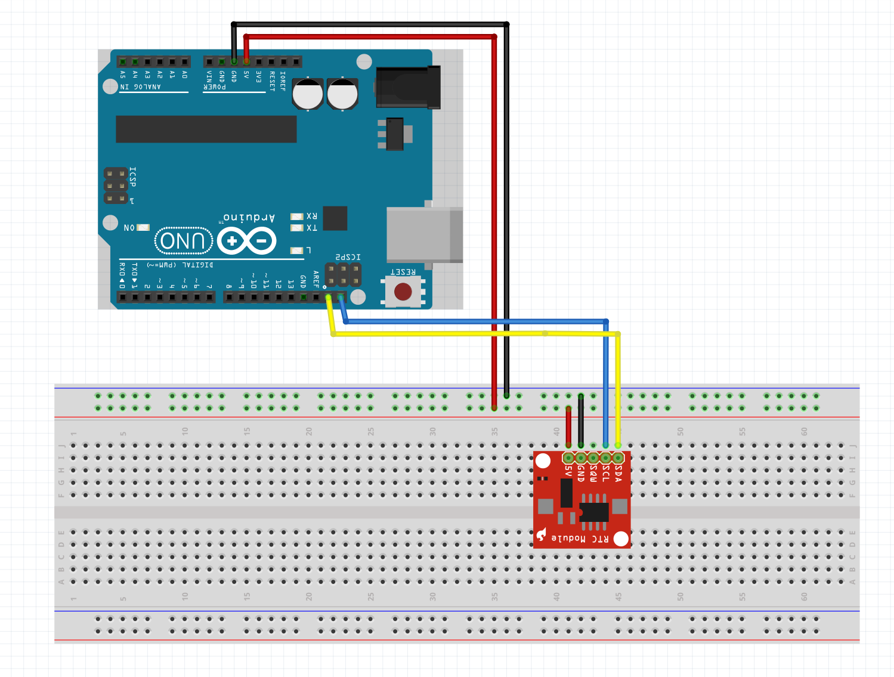

# 04 Pripojenie hodinového modulu RTC

```C
...
#include <SPI.h>
#include <RTClib.h>

RTC_DS1307 RTC; 

void setup() 
{
    ...
    RTC.begin();
    RTC.adjust(DateTime(__DATE__, __TIME__));
}
```

```C
String date() {
    DateTime now = RTC.now();
    String result;

    if (now.day() < 10) {
        result = '0';
    }

    result += String(now.day()) + '.';
 
    if (now.month() < 10) {
        result += '0';
    }

    result += String(now.month()) + '.' + String(now.year());

    return result;
}
```

```C
String time() {
    DateTime now = RTC.now();
    String result;

    if (now.hour() < 10) {
        result = '0';
    }

    result += String(now.hour()) + ':';

    if (now.minute() < 10) {
        result += '0';
    }

    result += String(now.minute()) + ':';

    if (now.second() < 10) {
        result += '0';
    }

    result += String(now.second());

    return result;
}
```


